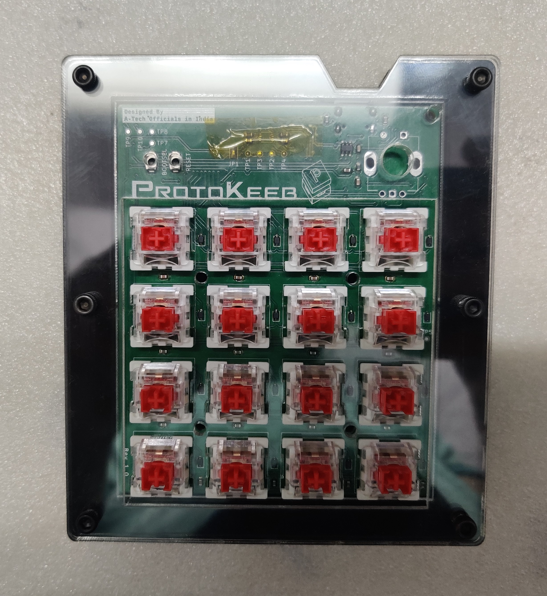

<picture>
 <source media="(prefers-color-scheme: dark)" srcset="Images/protokeeb_logo/protokeeb_logo_white.png">
 <source media="(prefers-color-scheme: light)" srcset="Images/protokeeb_logo/protokeeb_logo_black.png">
 
</picture>

# Protokeeb

### Overview

Protokeeb is a 16-key (4 x 4) keyboard/numpad/macropad/MIDI device designed by A-Tech Officials. It is ideal for those looking to get started with custom keyboards and open-source keyboard firmware. The PCB is based on a Raspberry Pi Pico development board, making it perfect for developers and enthusiasts eager to explore the world of custom keyboards and firmware.

## Features

- Per-key south-facing ARGB (WS2812B-2020) backlight LED.
- All anti-ghosting keys. It's a Mechanical Keyboard. Duh.
- N-Key Rollover
- On-board ESD/EMI protection.
- Rotary Encoder with push button.
- USB Type-C port. Not a feature anymore in 2024. #NoMoreMicroUSB
- Dedicated Bootselect and Reset Button for easy bootloader access.
- Supports various RP2040-based development boards that have similar SMD footprint and pinout to a Raspberry Pi Pico.
- 2MB/4MB flash storage for comprehensive keyboard firmware.
- Compatible with QMK, KMK, and ZMK keyboard firmware.
- Support both sandwich style/layered case or 3D-printed cases.

## Supported Dev Boards

- Raspberry Pi Pico
- Raspberry Pi Pico W
- Waveshare RP2040-Plus

## Getting Started

You can get started with Protokeeb hardware in two ways:

- **Option 1**: Order a fully assembled/soldered PCB from [A-Tech Officials](https://atechofficials.com/protokeeb) (Work-in-progress).
- **Option 2**: Download the Gerber and necessary files to order the PCB from your local or preferred PCB fabrication company and source all required electronic components yourself.

**Option 1** is a straightforward plug-and-play option, as each Protokeeb board comes pre-flashed with QMK firmware and a default keymap, allowing easy customization without worrying about the electronics.

**Option 2** is a DIY approach with detailed instructions provided for almost every step, ideal for those who want to immerse themselves in the learning, development, and customization aspects of custom keyboards.

> [!NOTE]
> Option 2 is not recommended for absolute beginners in electronics, as it requires specific skills and basic electronics knowledge, including proficient SMD soldering skills.

For detailed assembly instructions, follow this guide: [Assembly Instructions](assembly_instructions.md)

## License

This project is licensed under the MIT License. See the [LICENSE](LICENSE) file for details.

## Contributing

Contributions are welcome! Please fork this repository and submit a pull request with your changes.

## Support

For any issues or questions, please open an issue on GitHub.

## Acknowledgements

Thanks to the open-source community for their support and contributions.
