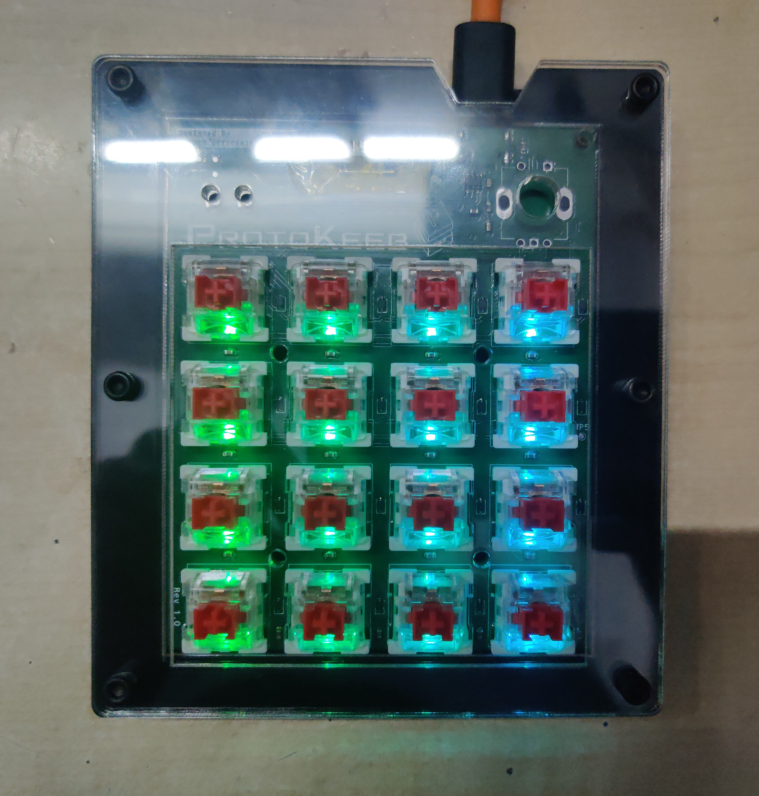

# Protokeeb Assembly Instructions

<details open>
<summary>PCB Rev 1.0</summary>

## Required Tools and Components

### Tools

- Soldering iron with a fine tip
- Solder wire with rosin flux core
- Low melting point solder paste
- Flux (optional but recommended)
- Tweezers
- Allen key/hex screwdriver bits (for case assembly)
- Multimeter (for testing connections)
- Hot air rework station (for soldering SMD components)
- Reflow hot plate (for soldering SMD components, optional)

### Optional Tools/Equipment

- Laser cutter (if you choose to cut your sandwich case layers yourself)
- 3D printer (if you choose to print your case yourself)

### Components

- Protokeeb PCB rev 1.0
- Raspberry Pi Pico / Raspberry Pi Pico W / Waveshare RP2040-Plus
- Mechanical switches (16)
- Keycaps (16)
- WS2812B-2020 LEDs (16)
- Diodes (17, as specified in the BOM)
- Rotary encoder with push button
- USB Type-C connector
- Various resistors and capacitors (as specified in the BOM)
- Various screws/bolts and nuts for mounting the Case and PCB
- Super glue
- Case (sandwich style/layered or 3D printed)

## Assembly Steps

### Step 1: Prepare the PCB for soldering

**Note:** I have not ordered the SMT stencil from the PCB fabrication house, so there are no images for the SMT stencil solder paste application process.

Choose one of the following approaches:

<details open>
<summary>Apply the Solder Paste Using the SMT Stencil</summary>

1. Align the Protokeeb SMT stencil properly with the Protokeeb PCB.

2. Secure the SMT stencil using masking or polyamide/Kapton tape.

3. Using a spatula or similar tool, spread the solder paste evenly over the surface of the SMT stencil, ensuring every pad of the PCB is covered with solder paste.

</details>

<details>
<summary>Apply the Solder Paste Manually</summary>

1. Use solder paste that comes in a syringe if possible, rather than in a small cylindrical container.

2. Select a small diameter blunt syringe needle (normally included with syringe-type solder paste).

   **Note:** Ensure the needle's diameter is not too small, or it will hinder the proper flow of solder paste.

3. Unlike the SMT stencil method, apply the solder paste only to the pads you are working on, such as capacitors, resistors, etc.

4. Spread the solder paste evenly, making sure not to accidentally bridge two separate pads by applying too much solder paste.

</details>

### Step 2: Prepare the SMD Soldering Equipment

<details open>
<summary>Hot Air Rework Station</summary>

1. Set the temperature of your SMD rework station according to the melting point of the solder paste.

   **Note:** Normally, a temperature of 250°C with 15 air works fine for most low melting solder pastes.

2. Secure the PCB on a PCB holder or using a third hand tool for easier soldering.

</details>

<details>
<summary>SMD Reflow Hot Plate</summary>

1. If you have a consumer or DIY SMD reflow hot plate, adjust the reflow curve settings according to the melting point and reflow properties of your solder paste. Otherwise, set the desired melting temperature.


2. Place the Protokeeb PCB on the hot plate. If the hot plate surface area is smaller than the PCB dimensions, add support beneath the PCB areas that are not in contact with the hot plate surface to keep the PCB flat during reflow.


</details>

### Step 3: Capacitor Placement

**Note:** Open the included interactive BOM file on your laptop/desktop/tablet during soldering to easily track components and placement.

1. Using tweezers, place the required capacitors on the correct pads according to the interactive BOM file. We are using 0603 package SMD capacitors, which can be easily misplaced if not handled correctly.


2. Start the reflow process if using a hot plate, or solder each capacitor one at a time using a hot air SMD rework station.


### Step 4: Diode Placement (Top Layer)

**Note:** Open the included interactive BOM file on your laptop/desktop/tablet during soldering to easily track components and placement.

1. Using tweezers, place the required 16 diodes on the correct pads according to the interactive BOM file. Ensure the diodes' direction is correct.

   **Note:** Refer to the interactive BOM for proper orientation.


2. Begin the reflow process if using a hot plate, or solder each diode individually using a hot air SMD rework station.

### Step 5: Resistor Placement (Top Layer)

1. Using tweezers, place the required resistors on the correct pads according to the interactive BOM file. We are using 0603 package SMD resistors, which can be easily misplaced if not handled correctly.


2. Begin the reflow process if using a hot plate, or solder each resistor individually using a hot air SMD rework station.

### Step 6: Voltage Level Translator IC Placement

1. Using tweezers, place the TXB0102DCU Voltage Level Translator IC on the correct pads according to the interactive BOM file. Ensure the IC's first pin is aligned with the PCB footprint's first pin.

   **Note:** Proper alignment is crucial for functionality.


2. Begin the reflow process if using a hot plate, or solder the IC using a hot air SMD rework station.


> There was a mistake in interpreting the datasheet of the TXB0102DCU Voltage Level Translator IC, which required circuit modifications for the Protokeeb RGB LEDs to work. This error has been rectified in the Protokeeb Rev 1.0 PCB files.

**Problem:** While designing the PCB, the TXB0102DCU IC's OE pin was pulled to ground with a 51K resistor, as suggested in the datasheet's "8.2 Typical Application" section. However, this caused the LEDs not to light up with data signals from the MCU. To fix this, I had to bypass the IC and connect the RGB data track directly to the RGB LEDs. Although not ideal since the MCU operates at 3.3V logic and the RGB LED is powered by 5V, this was a necessary modification.


**PCB Improvements:** The updated PCB includes an option to pull the TXB0102DCU IC's OE pin high or low using a 51K resistor and solder jumper bridges JP2 and JP3 to bypass the TXB0102DCU IC, allowing a direct connection from the RGB LED data pin to the MCU.


### Step 7: ESD Protection IC Placement

1. Using tweezers, place the USBLC6-2SC6 ESD Protection IC on the correct pads according to the interactive BOM file. Ensure the IC's first pin is aligned with the footprint's first pin on the PCB.

   **Note:** Proper alignment is crucial.


2. Begin the reflow process if using a hot plate, or solder the IC using a hot air SMD rework station.


### Step 8: RGB LED Placement

1. Using tweezers, place the 16 WS2812B-2020 RGB LEDs on the correct pads according to the interactive BOM file. Ensure each LED's first pin is aligned with the footprint's first pin on the PCB. The small SMD package size makes careful handling essential.

   **Note:** Proper alignment is crucial.


2. Begin the reflow process if using a hot plate, or solder each LED individually using a hot air SMD rework station.

   **Note:** Avoid high temperatures that can damage the LED lens.


> The Protokeeb Rev 1.0 PCB allows for two separate RGB data signals from the MCU: Rows 1 and 2 share "DATA-IN-1," and Rows 3 and 4 share "DATA-IN-2." This enables different RGB animations/colors for each group. To use a single data signal for all rows, bridge solder jumper "JP1."


### Step 9: Push Button Placement

1. Using tweezers, place the two SMD push buttons on their respective pads according to the interactive BOM file. Ensure proper alignment.


2. Begin the reflow process if using a hot plate, or solder each push button using a hot air SMD rework station.


### Step 10: Testing RGB LEDs

Before soldering the Raspberry Pi Pico development board onto the Protokeeb PCB, let's test the RGB LEDs.

1. Solder jumper wires to the following test pads:

   | Silkscreen Reference | Function  |
   | :------------------: | :-------: |
   |         TP1          |    5V     |
   |         TP2          |    GND    |
   |         TP3          | Data-in-1 |


2. Prepare a second Raspberry Pi Pico or any other RP2040 development board and upload the CircuitPython firmware onto it. You can get the CircuitPython firmware .uf2 file [here](https://circuitpython.org/board/raspberry_pi_pico/)

3. Download the required CircuitPython libraries from [here](https://circuitpython.org/libraries) For our testing purposes, we only need the "neopixel" and the "adafruit_led_animation" libraries.

4. Connect the Jumper wires to the RP2040 development board according to the table below:

   | Jumper Wire | RP2040 Dev board |
   | :---------: | :--------------: |
   |   TP1/5V    |        5V        |
   |   TP2/GND   |       GND        |
   |  TP3/Data   |      GPIO10      |

   **Note:** (Optional) Connect a 100-ohm resistor between the data pin of the RGB LED and the RP2040 pin (GPIO10).

5. Plug the Raspberry Pi Pico or RP2040 dev board into your computer. It should appear as "CIRCUITPY". Extract the CircuitPython bundle you downloaded and copy the "adafruit_led_animation" folder from the lib directory to the lib directory on your CircuitPython device.

6. Open the "code.py" file (located on your CircuitPython device) with your preferred editor and replace its content with the code below:

```python
import board
import neopixel
from adafruit_led_animation.animation.rainbow import Rainbow
import time

# Configuration for the NeoPixel LEDs
pixel_pin = board.GP10 # Change if required, according to your setup
num_pixels = 16 # Number of pixels, in our case 16-Keys so 16-pixels
# Specify the color order, e.g., neopixel.RGB in our case since using WS2812B-2020 LEDs
pixels = neopixel.NeoPixel(pixel_pin, num_pixels, brightness=0.5, auto_write=False, pixel_order=neopixel.RGB)

# Create a rainbow animation object
# Feel free to adjust the speed and period parameters of the
# Rainbow class to customize the appearance of the swirl effect.
# The speed parameter controls how fast the colors move,
# and the period parameter defines the length of the rainbow cycle.
rainbow = Rainbow(pixels, speed=0.1, period=2)

# Main loop to run the animation
while True:
    rainbow.animate()
    time.sleep(0.01)  # Short delay to make the animation smoother
```

7. Run the CircuitPython code and check if all the RGB LEDs are working properly.


### Step 11: Resistor Placement (Bottom Layer)

1. Grab the required resistors and place them on the correct pads according to the Interactive BOM file. Use tweezers to handle the 0603 package SMD resistors, as they can be easily misplaced.

2. Use a hot air rework station or a fine-tip soldering iron to solder the resistors one at a time.

   **Note:** You cannot use the SMD Reflow Hot Plate because the top layer of the PCB is populated with electronic components.


### Step 12: USB Connector Placement

1. Grab the USB 2.0/3.1 Type-C connector and place it securely on its respective pad according to the Interactive BOM file.

2. Use a hot air rework station or a fine-tip soldering iron to solder the USB connector securely.


### Step 13: Diode Placement (Bottom Layer)

1. Grab a Schottky barrier diode (according to the BOM) and, using tweezers, place it on its respective pad according to the Interactive BOM file.

   **Note:** Ensure the diode direction is correct as per the Interactive BOM file.

2. Use a hot air rework station or a fine-tip soldering iron to solder the diode securely.


### Step 14: RP2040 Development Board Placement

1. (Optional) If using a Raspberry Pi Pico or Pico W, it is recommended to de-solder its micro USB connector as it will not be used in this project.

2. Apply some solder paste on the Raspberry Pi Pico footprint/pads located on the Protokeeb PCB.

3. Align the RP2040 development board on its respective pad/footprint using tweezers.


4. Use a hot air rework station to solder it in place.

   **Note:** It is recommended to hover the hot air station handle on the entire RP2040 development board area in a circular motion to ensure the pads underneath solder properly with the PCB pads.


### Step 15: Rotary Encoder Placement

1. Take a rotary encoder with a built-in push button (as specified in the BOM) and place it in its respective location.


2. Apply some flux, and use a soldering iron to solder the rotary encoder in place.


Congratulations! You have just completed the soldering part of the assembly process. We are almost done.


### Step 16: Flash the Firmware

1. Connect the Protokeeb to your computer via USB.

2. Follow the QMK/KMK firmware flashing instructions to upload the firmware.

**QMK:** The QMK firmware file is included in this GitHub repo at "Firmware > QMK > protokeeb_rev1_default.uf2". Put the Protokeeb into bootloader mode and simply copy and paste the file into the Protokeeb's flash memory. This firmware file consists of the default keymap; if you need anything specific, please refer [here](https://docs.qmk.fm/#/newbs_building_firmware) for further development.

### Step 17: Initial Testing (Optional)

1. Before powering on the Protokeeb PCB, use a multimeter in continuity mode to test each pad and ensure the ground and power lines are not shorted.

2. After uploading the firmware, the RGB LEDs will turn on by default. Check if all the LEDs function properly.

3. Verify that the Protokeeb does not frequently disconnect from your PC.

4. Check these essential test pads for the correct voltages:

   | Silkscreen Reference | Function |
   | :------------------: | :------: |
   |         TP1          |    5V    |
   |         TP2          |   GND    |
   |       TP7/TP11       |   3.3V   |

### Step 17: Assemble the Case

<details open>
<summary>Sandwich/Layered Case</summary>

A sandwich/layered case is created in layers, with each layer adding thickness/dimension to the case. Common materials include acrylic (affordable and easy to laser cut), ABS, and polycarbonate. Metals like aluminum or stainless steel can be used but are more expensive.

**Note:** If you decided to use metal for your sandwich/layered case it is recommended to use a slightly flexible material for the switch plate layer and keep the switch plate layer thickness to not more than 2mm.

You can order the laser cutting parts for this case according to the table below:

Layer Specifications:

|       Layer        | Thickness |
| :----------------: | :-------: |
|     Top Layer      |    2mm    |
| Switch Plate Layer |    3mm    |
|   Close Layer-1    |    3mm    |
|    Open Layer-1    |    3mm    |
|    Open Layer-2    |    3mm    |
|   Close Layer-2    |    3mm    |
|    Bottom Layer    |    3mm    |

Total case thickness: 20mm.

You can customize colors for a unique look.

> You may find Protokeeb sandwich case images shown in this guide to be slightly different from the released CAD files because at the time of designing the sandwich case for the Protokeeb PCB I had done some mistakes. These mistakes has been rectified in the Protokeeb rev1.0 sandwich case CAD files.


1. Prepare the case:

   - Remove protective material/paper from acrylic parts.


2. Gather hardware:

   - x6 20mm long Allen/hex socket head M3 bolts
   - x6 M3 Nuts


3. Install switches:

   - Place 16 Cherry MX style/profile mechanical switches on the switch plate layer.


4. Solder PCB:

   - Solder the Protokeeb PCB onto the installed switches, securing it without additional screws.

5. Glue layers:

   - Apply super glue to the bottom layer and attach close layer-2.
   - Align correctly and press firmly.

6. Secure nuts:

   - Apply super glue to the M3 Nuts cutout on the merged layer (close layer-2 + bottom layer) and place all x6 M3 Nuts.

7. Stack layers:

   - Arrange layers in order: Open Layer, Switch Plate Layer, Close Layer-1, Open Layer-1, Open Layer-2, Merged Layer.

8. Assemble case:

   - Insert x6 M3 Bolts and tighten with an Allen key or hex screwdriver.


</details>

<details>
<summary>3D Printed Case</summary>

Work-in-progress...

</details>

### Step 18: Rubber Feet Placement (Optional)

Place rubber feet on the bottom side of the case to prevent the Protokeeb from slipping on the table surface.


### Step 19: Final Testing (Optional)

1. Press all mechanical switches to ensure they work without obstruction.

2. Check for any gaps between the layers of the sandwich case (unlikely to happen because we have designed the case according to the PCB dimensions and proper measurements).

3. Verify the USB Type-C port is properly aligned and accessible. Test by connecting a Type-C cable.

4. Connect the Protokeeb to your PC and ensure everything functions correctly, including RGB LEDs, switches, and the rotary encoder.

Congratulations! Your Protokeeb is now assembled and ready to use. Enjoy your custom keyboard!



For any issues or questions during assembly, please open an issue on GitHub.

</details>

<details>
<summary>PCB Rev 1.1</summary>

Work-in-progress...

</details>
